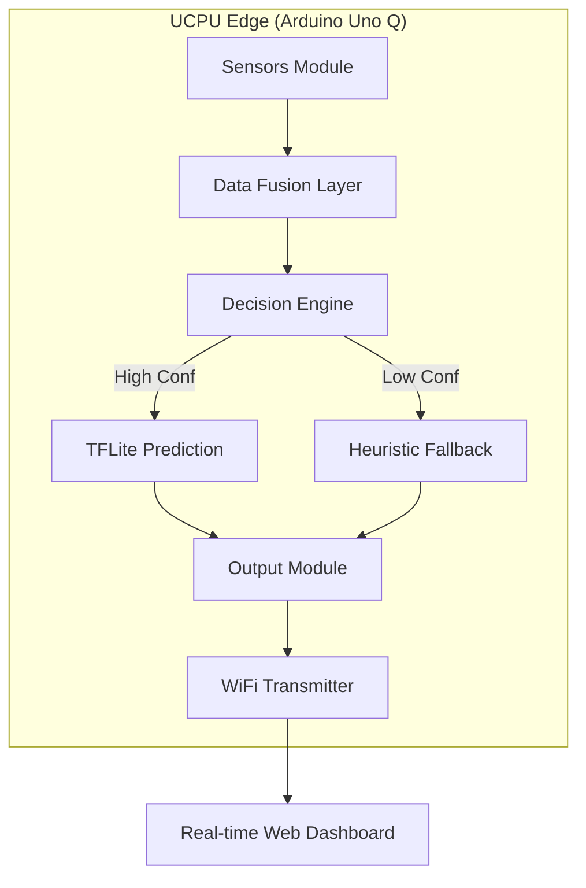

# UCPU: Wave Energy Prediction Buoy

[](https://github.com/EkagraAgarwal/UCPU)
[](https://www.arduino.cc/)
[](https://www.qualcomm.com/)

## 🌊 Project Overview

**UCPU** (Unified Control & Prediction Unit) is a remote marine device built on the **Qualcomm-enhanced Arduino Uno Q**. It is designed to predict wave energy potential and turbine power generation in real-time, providing a **30-60 second lead time** before waves reach the energy conversion system.

By leveraging **Sensor Fusion** and **Edge AI (TensorFlow Lite)**, UCPU enables grid operators and turbine controllers to anticipate energy surges and optimize power harvesting efficiency.

---

## 🏗️ System Architecture

UCPU operates as an autonomous edge node, processing high-frequency sensor data locally to generate low-latency predictions.



### High-Level Block Diagram
```text
┌─────────────────────────────────────────────────────────────┐
│                    ARDUINO UNO Q (Qualcomm)                 │
├─────────────────────────────────────────────────────────────┤
│                                                             │
│   ┌─────────────┐    ┌─────────────┐    ┌─────────────┐     │
│   │   SENSORS   │───▶│  DECISION   │───▶│  OUTPUT     │     │
│   │   MODULE    │    │   ENGINE    │    │  MODULE     │     │
│   └─────────────┘    └─────────────┘    └─────────────┘     │
│         │                   │                   │           │
│         ▼                   ▼                   ▼           │
│   ┌─────────────┐    ┌─────────────┐    ┌─────────────┐     │
│   │    DATA     │    │  PREDICTION │    │ TRANSMITTER │     │
│   │   FUSION    │───▶│   ENGINE    │───▶│  (WiFi)     │     │
│   └─────────────┘    └─────────────┘    └─────────────┘     │
│                                                             │
└─────────────────────────────────────────────────────────────┘
```

---

## 🔌 Hardware Components

| Sensor | Purpose | Data Type |
|:-------|:--------|:----------|
| **Temp/Humidity** | Atmospheric pressure correlation with wave patterns | Float (°C / %) |
| **Tilt Switch** | Measures buoy rocking motion (height/frequency) | Digital/Interrupt |
| **Water Level** | Direct measurement of local wave height | Analog |
| **Sound Sensor** | Captures wave crash intensity for calibration | Analog (Peak/RMS) |
| **Camera** | Computer vision for approaching wave crest detection | Image/Tensor |

---

## 🧠 Intelligence Layers

### 1. Data Fusion Layer
- **Normalization:** Scales raw sensor inputs to `[0, 1]` ranges.
- **Derivatives:** Calculates rate of change for pressure and motion.
- **Time-Windowing:** Maintains rolling averages and peak detection buffers.

### 2. Prediction Engine
*   **Primary: TFLite Model**
    *   Pre-trained on historical data from **Scripps Institution of Oceanography**.
    *   Quantized for efficient inference on the Qualcomm processor.
*   **Secondary: Heuristics**
    *   Rule-based fallback ensures 100% uptime even if ML confidence drops.

### 3. ML Pipeline
1.  **Ingestion:** Historical wave height + turbine power output (Scripps Dataset).
2.  **Engineering:** Feature extraction (wave period, tilt patterns, temp delta).
3.  **Training:** Time-series regression (Input: 30s window → Output: t+30s prediction).
4.  **Optimization:** TFLite conversion with INT8 quantization.
5.  **Deployment:** OTA update to Arduino Uno Q.

---

## 📊 Monitoring & Output

The system broadcasts a JSON payload via WiFi to a real-time dashboard:

```json
{
  "prediction": {
    "power_kw": 2.85,
    "eta_seconds": 32,
    "confidence": 0.94
  },
  "sensors": {
    "tilt_freq": 0.5,
    "water_level_m": 1.2
  },
  "status": "active"
}
```

---

## 🚀 Future Roadmap

- [ ] **LoRaWAN Integration:** For long-range transmission in deep-sea deployments.
- [ ] **Self-Charging:** Solar/Wave energy harvesting for the buoy itself.
- [ ] **Swarm Intelligence:** Multiple UCPU nodes communicating to create a 3D wave map.

---

## 🤝 Contributing

This project was developed during a Hackathon. Contributions, issues, and feature requests are welcome! 

1. Fork the Project
2. Create your Feature Branch (`git checkout -b feature/AmazingFeature`)
3. Commit your Changes (`git commit -m 'Add some AmazingFeature'`)
4. Push to the Branch (`git push origin feature/AmazingFeature`)
5. Open a Pull Request

---

## ⚖️ License

Distributed under the MIT License. See `LICENSE` for more information.
